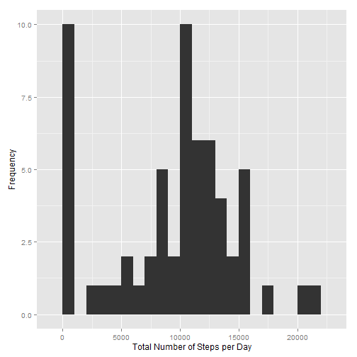
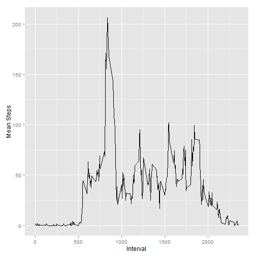
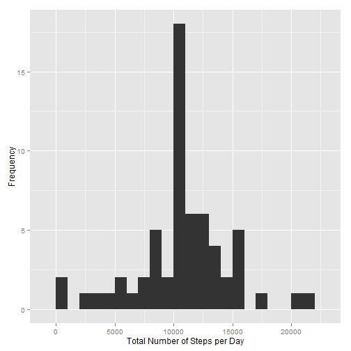
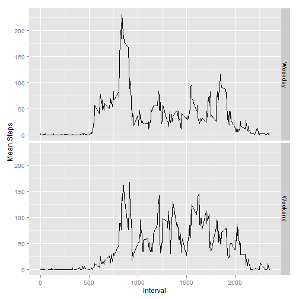

# Peer Assessment 1
  
<br><br>

The purpose of this assignment is to examine data collected from a personal activity monitoring device. An analysis is performed to determine average daily activity patterns, determine differences between weekday and weekend activity, and determine the effect of imputing missing data on the results.

<br>

### Loading and Preprocessing the Data

The first step is to load the raw activity data, which is found in a [zip folder](https://d396qusza40orc.cloudfront.net/repdata%2Fdata%2Factivity.zip) at the course website.


```r
activity <- read.csv("activity.csv")
```

Let us first examine the data.


```r
str(activity)
```

```
## 'data.frame':	17568 obs. of  3 variables:
##  $ steps   : int  NA NA NA NA NA NA NA NA NA NA ...
##  $ date    : Factor w/ 61 levels "2012-10-01","2012-10-02",..: 1 1 1 1 1 1 1 1 1 1 ...
##  $ interval: int  0 5 10 15 20 25 30 35 40 45 ...
```

As we can see, there are three variables in the data frame:

- **steps**: the number of steps taken in a given time interval, with missing values coded as `NA`
- **date**: the date on which the activity was measured
- **interval**: the 5-minute time interval during which the activity was measured, with values given indicating the clock time since midnight

<br>

### Determining Mean Total Steps per Day

To find the required mean, we must first determine find the total number of steps taken per day. Missing values are ignored in this step. A histogram of this data is displayed using the *ggplot2* R package.


```r
stepsperday <- tapply(activity$steps, activity$date, sum, na.rm = TRUE)
library(ggplot2)
qplot(x = stepsperday, geom = "histogram", binwidth = 1000, xlab = "Total Number of Steps per Day", ylab = "Frequency")
```

 

The mean and median of the total number of steps taken per day are determined as follows.


```r
mean(stepsperday)
```

```
## [1] 9354.23
```

```r
median(stepsperday)
```

```
## [1] 10395
```

So, the mean is **9354.23** and the median is **10395**.

<br>

### Finding Average Daily Activity Pattern

To show the required activity pattern, we must calculate the average number of steps taken per 5-minute interval across all days. A time series plot is then presented to demonstrate the pattern.


```r
meanstepsperinterval <- tapply(activity$steps, activity$interval, mean, na.rm = TRUE)
qplot(x = unique(activity$interval), y = meanstepsperinterval, geom = "line", xlab = "Interval", ylab = "Mean Steps")
```

 

We also require the 5-minute interval with the maximum number of steps, averaged across all days. It is determined as shown below.


```r
which.max(meanstepsperinterval)
```

```
## 835 
## 104
```

Thus, the maximum number of steps, on average, is taken during the interval **835**, or **between 8:35 AM and 8:40 AM**.

<br>

### Imputing Missing Values

As noted earlier, there are missing values in the *steps* variable, which may have caused bias in our calculations. First, let's find the number of missing values.


```r
sum(is.na(activity$steps))
```

```
## [1] 2304
```

So, there are **2304** missing values in the data. We now must devise a method to fill in these values appropriately. In the interest of simplicity, the strategy used here is to fill in each missing value with the mean for the 5-minute interval.

Below, we create a new data set which is identical to the original, only with the missing data filled in. We then create a histogram of the total number of steps per day, as well as calculate the mean and median of the total number of steps per day.


```r
# The new data set is created.
newactivity <- activity
for (i in 1:length(newactivity$steps)) {
    if(is.na(newactivity$steps[i])) {
        newactivity$steps[i] <- meanstepsperinterval[names(meanstepsperinterval) == newactivity$interval[i]]
    }
}

# The new total numbers of steps per day are calculated and the histogram is constructed.
newstepsperday <- tapply(newactivity$steps, newactivity$date, sum)
qplot(x = newstepsperday, geom = "histogram", binwidth = 1000, xlab = "Total Number of Steps per Day", ylab = "Frequency")
```

 

```r
mean(newstepsperday)
```

```
## [1] 10766.19
```

```r
median(newstepsperday)
```

```
## [1] 10766.19
```

Thus, the mean is **10766.19** and the median is **10766.19**. These estimates differ from those derived from the original data set, such that both the mean and median are now equal to the sum of the mean number of steps per 5-minute interval in the original data set. This is due to many days' worth of step measurements being missing in the original data set, which were now replaced with the means per 5-minute interval.

<br>

### Weekday and Weekend Differences

Now we wish to examine any differences between weekday and weekend activity. Weekends are defined as Saturdays and Sundays. A new variable is first added to our data set to separate weekday data from weekend data.


```r
newactivity$day <- weekdays(as.POSIXlt(newactivity$date, format = "%Y-%m-%d"))
for (i in 1:length(newactivity$day)) {
    if (newactivity$day[i] == "Saturday" | newactivity$day[i] == "Sunday") {
        newactivity$day[i] <- "Weekend"
    } else {
        newactivity$day[i] <- "Weekday"
    }
}
newactivity$day <- factor(newactivity$day, levels = unique(newactivity$day))
```

In order to view differences between weekday and weekend data trends, we now create a two-paneled time series plot of the mean number of steps per 5-minute interval.


```r
# A data frame is created to facilitate plotting.
weekdays <- subset(newactivity, day == "Weekday")
weekends <- subset(newactivity, day == "Weekend")
weekdaymeans <- tapply(weekdays$steps, weekdays$interval, mean)
weekendmeans <- tapply(weekends$steps, weekends$interval, mean)
weekdays$means <- rep(weekdaymeans, length.out = length(weekdays$steps))
weekends$means <- rep(weekendmeans, length.out = length(weekends$steps))
weekmeans <- rbind(weekdays, weekends)

# The plot is created.
qplot(data = weekmeans, x = interval, y = means, geom = "line", facets = day ~ ., xlab = "Interval", ylab = "Mean Steps")
```

 

There is a clear difference exhibited between weekday and weekend activity. Weekday activity peaks during the early morning, with the afternoon and evening hours seeing a moderate amount of activity. However, weekend activity is somewhat consistent throughout daylight hours.
